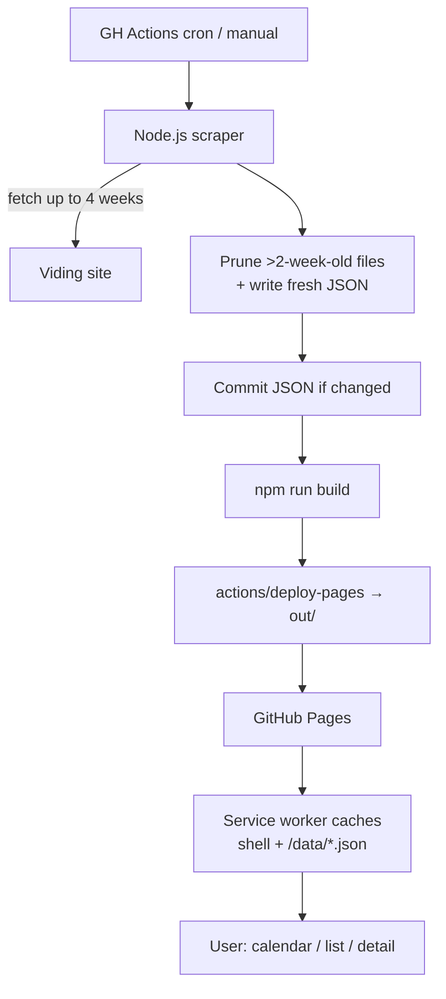

# ViVaCal

A clean, installable PWA for the [Viding Valladolid](https://valladolid-viding.viding.es/) gym schedule. Built because the original site is hard to read on any screen.

ViVaCal shows the weekly group-class schedule as a color-coded calendar (or a scannable list), with filters by category, instructor, and room, an activity detail view, offline support, and full installability on phones and tablets.

**Live:** https://&lt;user&gt;.github.io/&lt;repo&gt;/

## Tech stack

- **Next.js 16** with static export (`output: 'export'`)
- **Tailwind CSS 4** for styling
- **Serwist** for the service worker (Workbox-based PWA)
- **cheerio** for HTML parsing in the scraper
- **GitHub Actions** for scheduled scraping + building + deploying to **GitHub Pages**

No server, no database, no runtime backend. Everything is static.

## Local development

```bash
npm install
npm run dev         # http://localhost:3000
npm run build       # produces ./out
npm run lint
npm run scrape      # fetches fresh data from Viding into public/data/
```

Requires **Node.js 22+** locally; CI uses Node 24.

## How the data scraper works

A single GitHub Actions workflow at `.github/workflows/scrape-and-deploy.yml` runs **twice daily** (07:00 and 19:00 UTC) plus on every push to `main` and on manual dispatch.

On each run it:

1. **Scrapes up to 4 weeks** of schedule data from Viding, starting at the current Monday. It stops early when a week comes back empty (Viding currently only publishes ~2 weeks ahead).
2. **Preserves the previous 2 weeks** of already-scraped data. Files older than `currentMonday - 14 days` are pruned; everything from the cutoff onwards stays. This gives users a rolling ~6-week window (2 past + current + up to 3 future) even though Viding itself only serves current/future weeks.
3. **Commits changed JSON** back to `public/data/` with the `github-actions[bot]` identity and `[skip ci]` so the bot commit doesn't self-trigger the workflow.
4. **Builds** the Next.js static export.
5. **Deploys** the `out/` directory to GitHub Pages via `actions/deploy-pages`.

The scraped data shape:

- `public/data/activities-YYYY-MM-DD.json` — one file per Monday-starting week, each with `{ weekStart, activities: [...] }`
- `public/data/manifest.json` — index with `lastUpdated`, `earliestWeek`, `latestWeek`, and the sorted list of available weeks. The UI uses this to bound week navigation.

## Enabling GitHub Pages

In the repo **Settings → Pages**, set the source to **GitHub Actions**. No branch-based publishing.

## Manually refreshing data

**Actions** tab → **Scrape and Deploy** → **Run workflow** on `main`.

## Architecture



## Project layout

```
.github/workflows/   GitHub Actions workflow
public/
  data/              scraped JSON + manifest (committed)
  icons/             PWA icons
  manifest.webmanifest
scripts/
  scrape.mjs         main scraper entry
  lib/categories.mjs ESM mirror of src/lib/categories.ts
  generate-icons.mjs pure-Node PNG icon generator
src/
  app/               Next.js App Router
    layout.tsx       html lang="es", metadata, PWA link
    page.tsx         renders <AppShell> with calendar/list
    sw.ts            Serwist worker (precache + SWR for data)
  components/        AppShell, WeekNavigator, ViewToggle, FilterBar,
                     LastUpdatedBanner, WeekCalendarView, ActivityBlock,
                     ListView, ActivityDetailPanel
  context/AppState.tsx  React context for week, view, filters, selected activity
  hooks/             useManifest, useWeekActivities
  lib/               basePath, dataLoader, filters, categories
  types/activity.ts  shared interfaces
```

## Troubleshooting

- **Scraper exits non-zero in CI** — usually means Viding changed their HTML. The scraper reads a `data-json` attribute on activity buttons; if that attribute is renamed/removed, update `scripts/scrape.mjs` (`parseWeekHtml`). The app continues to serve the last successfully deployed data.
- **Pages not updating** — check the latest workflow run in the **Actions** tab. If the `Setup Pages` step fails, confirm Settings → Pages → Source = "GitHub Actions".
- **Icons missing** — `public/icons/*.png` are committed; if they're missing run `node scripts/generate-icons.mjs`.
- **Service worker stale** — Serwist uses `skipWaiting: true` and `clientsClaim: true`, so the next reload activates the latest SW. Hard-reload once after a deploy.

## License

MIT.
